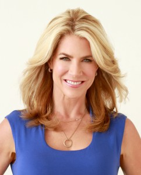
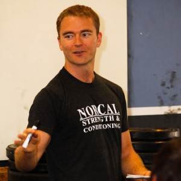
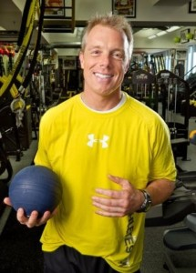
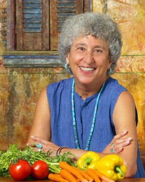
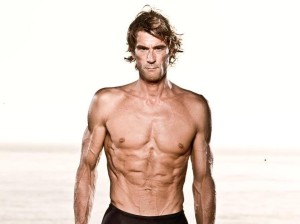
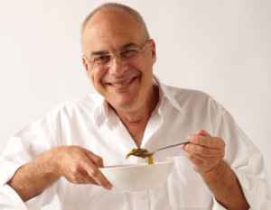
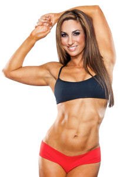
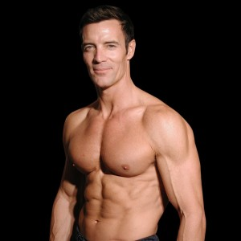

 

I’m going to be lovingly honest here…

There are far too many “health experts” preaching so-called “health advice” that we are being led to believe is the Holy Grail of the “healthy lifestyle” dream we’re chasing.

They are spoonfeeding you catchy claims like:

_“6-pack secrets they don’t want you to know!”_

_“Fat-burning formula to lose 20 lbs. in 7 days!”_

And best of all...

_“The limitless magic pill they created from a powerful ingredient accidentally discovered by a group of scientists in the ancient city of Timbuktu that will change EVERYTHING!”_

And unfortunately — **we’re eating it right up**.

Do you know the big problem with this?

A large majority of those “health experts” haven’t put in their 10,000 hours of research, have no evidence supporting the fictitious “beneficial claims” they’re promising you, and probably (not probably… definitely) care more about their social status on social media than they do your health and wellbeing.

**Basically, their “advice” is hurting you more than it’s helping you** — and sorry, but your dream bod will take longer than that.

## The Truth You’re Seeking

It’s time to expose these myths… so that’s why I reached out to the REAL leaders in this industry and asked them ONE simple question:

_“What’s the most sabotaging health myth you wish the mainstream world had not been exposed to entering 2016?”_

As I expected, I received enthusiastic replies with the health-sabotaging myths **they wish YOU knew**. They delivered well-supported claims that will finally debunk the myths secretly sabotaging your health, happiness, and excitement for living.

If you feel shackled to a life of confusion and mediocrity when it comes to health, then this article will set you free.

Let’s begin.

##  1.) JJ Virgin — [JJ Virgin Website](http://jjvirgin.com/ "JJ Virgin")

> “The so-called healthy foods that come loaded with sneaky sugar and often create food intolerances. I'm talking about fruit-on-the-bottom yogurt, breakfast cereals, and less-obvious culprits like balsamic vinegar and marinara sauce. We have become better aware of things like coffee drinks, which a recent report found can contain up to 25 teaspoons of sugar, but people are less aware that sneaky sugars in so-called healthy foods can deliver a massive sugar dose that wrecks havoc on our waistlines and overall health...”

I 110% agree with this comment by JJ Virgin.

When something comes in a box or a package, it’s good practice to look for the nutrition facts label and look at two things: net carbohydrates and sugar. Net carbs = Total carbs – Fiber. This will give you an idea of the amount of sugar (glucose and fructose) in the product.

If the products net carbs are in the double digits with little to no fiber, you can expect a spike in your blood sugar. And the dreaded spike in blood sugar will raise your insulin levels — which is not good. We all have different sensitivities to sugar and insulin; some of us (diabetics) have lost our sensitivity to insulin altogether.

If you notice your energy and happiness plummet throughout the day, there’s a good chance you’re eating more sugar than what your body can handle in any given moment.

**My advice**: _If you absolutely must treat yourself with a sugary beverage or treat, do it after you’ve worked out when your carb stores are low._

Otherwise, try swapping the sugary food with something high in healthy fat; like avocado, coconut meat, or a tablespoon of unsweetened almond butter. High fat foods can cut cravings for sugar while satiating the body.

##  2.) Neghar Fonooni — [Neghar Fonooni Website](http://www.negharfonooni.com/ "Neghar Fonooni")

> “I would say the thing I'd want the mainstream world to know is that you have more to offer the world than your body fat composition. I work with women all over the world who are struggling to reclaim their worthiness, because as a culture, we've tied our worthiness as women so strongly to our appearance…”

Though physical health plays a key role in your life and stability over the long term, there are other factors that play just as important a role — if not more — in your wellbeing: your emotions and your mindset.

Thanks to the media’s distorted and superficial image of health, we’ve booked a first-class ticket on the vehicle of vanity to attain happiness. But the truth is, when we develop a strong and loving connection with ourselves at our core, we naturally begin to treat ourselves with respect.

**My advice**: _Write a love note or affirmation to yourself and keep it somewhere you know you’ll see at least once a day._

When you see it, read it out loud. I kept mine on my mirror for 2 years until the words naturally found their way into my conscious: “I am a heart-centered jedi warrior goddess of truth.” The other one I learned at an event I attended last year in Croatia called A-fest: “I am enough.”

##  3.) Robb Wolf — [Robb Wolf Website](http://robbwolf.com/)

> “The most sabotaging health myth I know of is that you can get by on less than 7-9 hours of sleep per night. Sleep is likely the most important component of health, and lack of sleep will sabotage health, performance, longevity, and weight loss more quickly than just about anything I can think of.”

This is one of the most important myths to debunk in my opinion because not enough importance is placed on sleep.

Sleep debt is very real — those hours of sleep you missed while staying up until 5am are still affecting your body today. Which means the more we skip sleep, the more sleep we need to catch up on... And the only way to pay it back is through sleeping more.

Sleep offers us many benefits; one of them being the fasting state (not eating any food for a period of time). In this state, your body and brain have an opportunity to rest, rebuild, and essentially “get rid of the garbage.” If that’s not enough to convince you, a recent study showed that less than 7 hours of sleep a night was linked to a higher risk of obesity, diabetes, heart disease, stroke, mental distress, and early death.

**My advice**: _Get access to bright light (sunlight) during the day to maximize blue light exposure, and as the sun goes down, gently detach from your technology._

If you absolutely must use technology at night, buy some blue light goggles. This should normalize your circadian rhythm and get you back into a healthy flow.

##  4.) Gunnar Peterson — [Gunnar Peterson Website](http://gunnarpeterson.com/)

> “Lifting weights will make you big.”

There’s a lot to unpack here, as the situation changes depending on the amount of the weights, reps, gender, and your lifestyle.

For women, it’s important that we know our muscles cannot be compared to men simply because of our differences in hormones; in particular, testosterone. Weight lifting is unlikely to make a woman “big” like most of them fear.

**My advice**: _Focus on its many benefits, like improved metabolism, body awareness, endurance and mental strength._

##  5.) Mark Fisher — [Mark Fisher Fitness](http://markfisherfitness.com/)

> “The most sabotaging health myth I see particularly in regards to fitness is that ‘more is better.’ For instance, the goal is to do an appropriate amount of training at an appropriate intensity for a given goal, not as much and as hard as possible…”

The emergence of personalized health tells us that no two people are alike.

We all have varying needs and susceptibilities dependent on our own lifestyles, environmental factors, and genetic factors. Therefore, there is no one-size-fits-all solution for everyone. For some, crossfit is the best medicine, and to others, it’s yoga.

**My advice**: _Start with a low hanging fruit health goal — be it fitness or food related_.

Work on building it into your day as a new habit before moving on to your next goal. Once you have a few small wins under your belt, celebrate them, and then give yourself permission to graduate to a more challenging goal that seems right for you. Keyword: YOU (not “them”).

##  6.) Darya Rose — [Summer Tomato](http://summertomato.com/ "Darya Rose")

> “The greatest health myth I encounter every day is that you need to sacrifice and deprive yourself to be healthy, and that if you had more willpower to do this, you would succeed. Nothing could be further from the truth. Instead of depriving yourself to be healthy, you must find healthy activities you enjoy so they can become habits, which by definition, don't require willpower...”

Though I agree with this in theory, I do believe there is a window of discomfort that often follows a health reset.

Particularly when one is experimenting with the avoidance of toxic triggers and experiencing symptoms from the withdrawal of those triggers. There is power and healing in learning to find comfort within the discomfort — and almost always — willpower is your primary fuel to do so.

This uncomfortable process can prove to be transformative. Intermittent fasting is another exception to this, whereby the short-term deprivation can lead to life-changing, or rather, life-extending results. Compensating with a high-fat “bulletproof” drink during the fasting period may serve as a way to minimize the use of willpower and cravings.

**My advice**: _Work on small, realistic healthy goals to build up the momentum and motivation before tackling harder to reach goals._

So while I agree that we must find activities and practices that we love in order to build them into daily sustainable habits, I do believe in the power of a small window of discomfort in opening up new channels to success and happiness.

##  7.) Kathryn Budig — [Kathryn Budig Website](http://kathrynbudig.com/)

> “I wish people would understand that there is no single road or fix to good health. Take the time to find out what style of nutrition and exercise fits YOUR body and needs, and not necessarily what is trending or expected.”

As personalized health tells us, we are individuals with our own needs, predispositions, and sensitivities.

However, given the current research and risk factors for chronic disease, there is a lot we can use as general guidance, especially as we begin to venture on our path to optimal living. For example, the first 5 steps to recovery for two different people, both consuming a high-carbohydrate and low-fiber diet may be similar, if not the same. But the next 5 steps may be more individualized — and by this point — person A (or B) would hopefully be more empowered and motivated to continue on a lesser-known path.

**My advice**: _Find a buddy or accountability partner to support you on your individual journey (but remember to always celebrate shared milestones)._

##  8.) Steve Kamb — [Nerd Fitness](https://www.nerdfitness.com/)

> “The most sabotaging myth the world should know entering 2016 is that relying on inspiration or motivation to get healthy just doesn't work. It might help you get started, but it won't be there over the months and months, and (hopefully) years and years of getting and staying healthy. We don't do things over the long run because they inspire us, we do them because they become habits...”

I wholeheartedly agree. When it comes to business, we tend to agree that ideation is followed by a business plan, which is then followed up with tangible steps and goals.

However, when it comes to health — for some bizarre reason — we tend to get stuck in the ideation phase (setting our goals), and then we get discouraged when we fall off. Though inspiration and motivation are important drivers to take action, they may not be enough to create long-lasting sustainable changes.

**My advice**: _Get clear on your health goals._

Be specific. Write out your 1-month, 3-month, 6-month and 1-year goals — and besides each goal, make note of why the goal is important to you. Repeat this until they become your natural habits and then move on to the next, even bigger step.

##  9.) Marion Nestle, Ph.D., M.P.H. — [Food Politics](http://www.foodpolitics.com/)

> “If I had one thing to teach the world, it would be that larger portions have more calories. If you want to lose weight, the best way to do it is to eat less (smaller portions!).”

While I agree that excessive eating is a culprit of obesity and disease — and that weight loss can be achieved in fasting states — I would be mindful about generalizing too much when it comes to portion control.

Two things are far more important than the total amount of calories in a food: quality and nutrient density. For example, a small plate of fries cannot be supported as being better than a giant green salad. For many people struggling to lose weight, moving to a more nutritious (free from deep-fried and refined sugar) macronutrient-balanced diet can be the best strategy for weight loss.

##  10.) Rich Roll — [Rich Roll Website](http://www.richroll.com/)

> “The most sabotaging health myth of 2016 I would like to disabuse people of is the notion that “Butter Is Back” and that eating a high fat diet is healthy. Do not be fooled by the array of recently published books and so-called “health experts” supporting this supposition. It is preposterous, irresponsible and unsupported by true nutrition research…”

Monounsaturated fat — as a health food — has actually been understood and appreciated for years, along with the negative effects of hydrogenated fats and trans fats.

It’s the consumption of saturated fat that seems to be a common area of debate and misunderstanding within the scientific community, particularly around the consumption of coconut oil and grass-fed butter — two of the best examples of saturated fat today.

While I agree that pop culture can blow health trends out of proportion and lead to serious consequences, this particular trend has a strong scientific basis and is supported by many key opinion leaders in the field. There is strong evidence suggesting that people can reduce their risk for heart disease by eating fewer carbohydrates and more dietary saturated fats.

This way of eating has also been linked to a reduction in body fat and overall weight. The medium-chain fatty acids (MCFAs) in both coconut oil and butter can also increase energy and metabolism through their unique metabolic feature, which has contributed to the popular use of these products in the biohacking and productivity-hacking community.

**My advice**: _Express caution on the consumption of hydrogenated or trans fats, which do have a negative impact on your fat levels._

##  11.) Mark Bittman — [Mark Bittman Website](http://markbittman.com/)

> “One myth, with two parts: a.) we need to eat A LOT of protein, and b.) that protein is only found in animal flesh. That's what I'd like to get rid of...”

An excessive intake of protein is a far greater problem than low protein consumption, especially for those of us who are eating an inflammatory diet (one that is heavy on packaged foods and refined carbohydrates).

In these cases, heavy protein consumption can amplify the growth of cells and even override the body’s ability to kill those cells that have been damaged (i.e., cancerous cells). Another reason we want to be mindful of our protein consumption is that our body naturally converts excess protein to glucose through a process called gluconeogenesis. For those of us who are trying to keep blood sugar levels down or reset our sensitivity to insulin, it’s important for us to keep this notion in mind.

Another important point is that it’s unnecessary to ingest a complete protein in one sitting. Our bodies are more intelligent than we’ll ever understand; they are able to utilize and recycle consumed amino acids across a number of hours to keep our bodies functioning properly. Because of this, we actually end up with far more protein than we think, especially considering the variety of amino acids found in non-meat sources, like produce, legumes, nuts, seeds, and superfoods like spirulina.

##  12.) Natalie Jill — [Natalie Jill Fitness](https://www.nataliejillfitness.com/)

> “The most sabotaging health myth I wish the mainstream world knew is that "diet" foods are good for us. Anytime you replace "fat" with fat-free or "sugar" with sugar-free we end up with chemical junk…”

While I wholeheartedly agree with the power of unprocessed, natural foods and the avoidance of processed “machine poo”, I do caution the consumption of sugars altogether, whether artificial or natural.

Sugars from fruit, as an example, can be responsible for poor health symptoms like chronic fatigue, mood imbalances, diabetes, and yeast overgrowth. Rather than position the recommendation to steer clear of diet foods, I’d prefer to focus on opportunities to empower people to better understand how their systems respond to all foods.

**My advice**: Write in a journal about your levels of energy and how you feel before and after food consumption.

##  13.) Jennipher Walters and Erin Whitehead — [Fit Bottomed Girls](http://fitbottomedgirls.com/)

> “The most sabotaging health myth we hear time and time again is that you have to "diet" to lose weight. Diets do not work. If they did, there wouldn't be a million of them out there! Instead, focus on making small healthy tweaks to your day, day after day, to build healthy habits...”

I agree that an ideal place to begin your health journey is by making small tweaks and getting some easy wins to build momentum and motivation.

It’s not a good idea to vilify the word diet and turn it into the “bad guy”. Diet has a broad meaning covering all intentional nutrition patterns — some good, some bad. For certain people, a diet is the equivalent of a quarterly cleanse or reset with the intention of clearing damaged cells, toxins, and improving nutrition. The side effect is often controlled weight loss.

Fasting is another form of dieting. It is often practiced with the intention of improving long-term health, extending life expectancy, and of course, losing weight. I personally don’t see anything wrong with well-designed weight loss and detoxifying diets — assuming the person adopting it is clear on their goals and limits.

##  14.) Tony Horton — [Tony Horton Life](http://www.tonyhortonlife.com/)

> "The myth that lasting physical, mental and emotional health comes in the form of a pill, a quick fix, or some one-dimensional workout program. This misnomer is common sense to anyone who lives a healthy lifestyle, but most folks still looking for the fountain of youth are stuck in the merry-go-round of fad after fad — just hoping or wishing that something is going to change..."

Preach the truth, Tony!

Slow and steady wins the race. It’s important to guide people towards the path of optimal living by speaking their language and helping them grasp and achieve the most accessible health hacks for them. Good health is a lifelong commitment and journey — once people are on the path, they’ll be able to understand this notion more clearly with confidence and motivation.

## Conclusion

As you can see, these responses are being fueled by a passionate fire of their own. And a lot of these responses contradict what’s being preached by social media, the status quo, and society at large.

So you might be wondering this:

_“What the heck is the right answer to living a healthy, optimal lifestyle?!”_

If this is going through your mind right now, you seeker of truth, then congratulations — you’re beginning to ask the golden question.

There is no “one-size-fits-all” approach or quick-fix magical solution. The honest answer — which you may not like hearing — **is there are MANY answers**; what works for some doesn’t necessarily work for others.

I highly encourage you to take the time to do your research and experiment with what feels right for you. There is an entire world of information out there with the exact answers you’re seeking… the tough part is separating the fluff from the facts.

Remember — **listen to your body, be gentle with your mind, and do what “feels” right to your soul**… for these will always be your best guides.

But before you go, let me challenge you.

After reading this article, how can you level-up your health game? What areas of your life are you blindly following advice from “health experts” without understanding how it truly works (or IF it even works)? What new tip or hack might you be inspired to learn about and implement?

It’s time to rise up and be better than the status quo.

**You’re destined for an abundance of health, love, and child-like happiness** — your breakthrough is just one simple moment away.
