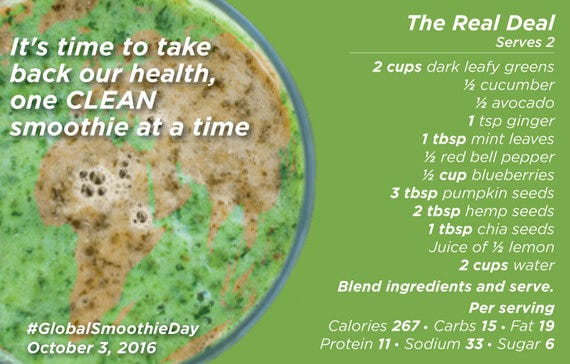

##### You might be surprised about what gets passed off as a smoothie these days.

Smoothies are all the rage. They’ve quickly become a full-blown, worldwide health trend.

Billed as the healthy solution for your crazy, on-the-go, fast food lifestyle (while keeping your crazy, on-the-go, fast food lifestyle), green smoothies are seemingly everywhere; even showing up on the shelves of the most popular (but not necessarily health-conscious) department stores.

In fact, smoothies are so popular, Global Industry Analysts, Inc., a leading market research firm, estimates that the smoothie industry has grown into a $9 billion dollar-a-year market — yes, that’s billion with a “b”.

**At the same time as these mass produced smoothies are skyrocketing in popularity, cases of diabetes and obesity worldwide are approaching 2 billion. (There’s that “b” again!).**

So will the smoothie trend be accompanied by a reduction in these health issues? With no signs of a statistical turnaround to date and grim health forecasts for the coming years, the correlation might be the exact opposite.

**Wait… how could you possibly think there might be a correlation between the rise of “healthy” smoothies and bulging waistlines?**

Aren’t the messages from smoothie merchants such as Jamba and Booster Juice just making you eagerly reach for this healthy alternative to fast food? To this I say: NOT. SO. FAST.

In reality, the health claims floating around mainstream smoothies are not only misleading, but they can also be dangerous. Often consisting of 70% sugar, and made with low-quality, high sugar fruits and fruit juices, these smoothies can contain upwards of 60 grams of sugar.

### Green Smoothies: Not Your Run-of-the-Sugar-Mill Smoothie

Fortunately, not all smoothies are unhealthy or dangerous — in fact, green smoothies, when made with the correct vegetable to fruit ratio, along with healthy fats and plant proteins, not only provide greater nutrition than many common sit-down meals, but also serve as an easy, real-food alternative to many dubious prescription medicines.

**In other words, it’s time to celebrate Global Smoothie Day!**

Your body is craving something real — listen to it! This October 3rd, take the opportunity to stop and listen deeply to your body’s needs and learn more about what makes you thrive from the inside out.

Global Smoothie Day is a chance to do just that, a chance to give your body what it has been asking for.

It’s also the time to celebrate the goodness that green smoothies and self-care practices bring to your life with friends, family, and colleagues.

Global Smoothie Day serves as a platform to educate, motivate, and connect self-care seekers around the globe. Join me in this exciting movement that celebrates health empowerment and advocacy.

### Meet The 60–20–20 Real Green Smoothie

Typically consisting of 60% vegetables and superfoods, 20% healthy fats and plant proteins and 20% low glycemic (GI) fruits, green smoothies aren’t your average, everyday smoothie. As a point of reference, low glycemic index fruits, or those with a GI of below 55 have less of an impact on your blood sugar; essentially, they keep your blood sugar from spiking and crashing — the common cause of low energy, weight gain and food cravings.

Here's a list of vegetables, healthy fats and low GI fruits commonly used in green smoothies:

**Vegetables**

- Kale
- Spinach
- Broccoli
- Cucumber
- Celery
- Bell Pepper
- Fennel
- Sprouts
- Chard
- Carrots
- Tomato
- Ginger

**Low Glycemic Fruits (GI Score)**

- Cherries, (20)
- Grapefruit, (25)
- Apricot, (32)
- Pear, (35)
- Apple, (38)
- Blueberries, (40)
- Green banana (40)

**Healthy Fats (omega 3s, 6s, mono-, poly- and saturated fats)**

- Avocado
- Chia seeds
- Flax seeds / Flax oil
- Hemp seeds
- Pumpkin seeds
- Almonds
- Sunflower seeds
- Coconut oil

 

### The Amazing Health Benefits of Green Smoothies

1 or 2 servings of green smoothies per day has you well on your way to meeting your recommended daily intake of essential nutrients, including vitamins A, C, E, K, B5, B6, B9, magnesium, potassium, calcium, phosphorus and zinc.

In addition, the fiber, phytochemicals, plant based protein and healthy fats in green smoothies turn them into a complete meal, leaving you with sustained energy, a satiated palate, and diabetes and obesity in your rear-view mirror.

### Green Smoothies Are Loaded With Fiber

Green vegetables are loaded with fiber; this fiber, when consumed in its raw form stays in the digestive system and breaks down slowly; this not only keeps you feeling full over a longer period of time, it also ensures maximum nutrient absorption.

Fiber binds (actually sticks!) to several toxins and known carcinogens found in foods; fiber also moves waste and these toxins quickly through the intestinal tract and out of your system, preventing these harmful chemicals from being absorbed by the body.

### Green Smoothies Prevent the Dreaded Blood Sugar Spike

We know that low GI fruits and vegetables are essential when balancing blood sugar levels. Research also demonstrates that fiber is equally as important in lowering blood sugar and eliminating the unwanted associated side effects, including low-energy, hunger, and cravings.

People associate fruit and fruit juice with good health, but consuming too much fructose (the sugar found in fruits) can actually impede the liver’s ability to convert it into usable energy. Instead the fructose is converted and stored as fat. Fructose has also been associated with stimulating hunger after a meal and has even been shown to cause physical and neurochemical dependency — that’s right, the natural sugars found in fruits are addictive!

### Make Everyday Global Smoothie Day

You’ve heard all about the amazing health benefits of the “real” green smoothie, so what are you waiting for? GO DRINK A GREEN SMOOTHIE! You _do_ have time, you _can_ afford it, you _know_ how to make one (if not, [click here](http://bit.ly/2dpfKsF)!), or go custom order one — your fav smoothie bar will be happy to whip up a customized 60–20–20 green smoothie just for you!

Plus, we’re sharing 50 Doctor-approved Clean Smoothie Recipes at our favorite price — FREE — to help everyone easily start working with this new, healthy fast food.

**GLOBAL SMOOTHIE DAY IS RIGHT AROUND THE CORNER ON OCTOBER 3rd, 2016**

[CLICK HERE FOR YOUR GLOBAL SMOOTHIE DAY STARTER KIT](http://bit.ly/2dpfKsF)

### Why I founded Global Smoothie Day

Inspired by the focus of my PhD which examined the toxic effects of the Western Diet, as well as the “real food medicine” that helped me reverse chronic illnesses and the symptoms of my clients, I felt it was time to launch a platform to share health education and evidence-based truths to motivate the masses to enter this overwhelming world of health in a safe and sustainable manner. Using creativity and optimism as my guiding principles, I brought this vision to life through Global Smoothie Day.

 

References:

[“Smoothies (MCP-6332) — Global Industry Analysts, Inc.](http://www.strategyr.com/Smoothies_Market_Report.asp)” 2010. 16 Sep. 2016

[“WHO | Obesity and overweight.](http://www.who.int/mediacentre/factsheets/fs311/en/)” 2006. 16 Sep. 2016

[“Obesity and severe obesity forecasts through 2030.](http://www.ncbi.nlm.nih.gov/pubmed/22608371)” June 2012. Am J Prev Med
