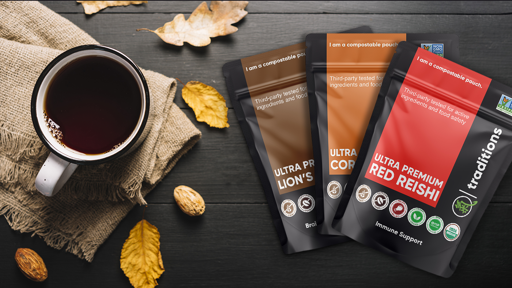

Fungi have been around on the Earth for more than 2 billion years, pre-dating animal and plant life. While some species are poisonous, there are a number of species with superpowers that can nourish, heal, and boost the health of humans and our shared planet.

The latter are referred to as medicinal mushrooms. These fungi deliver more healing than meets the eye. Superficially, they are loaded with vitamins and minerals, which is surely one of their superpowers. However, they also have bioactive components that they release to protect themselves during times of stress.

These bioactive ingredients have incredibly therapeutic, and even magical healing properties, which historically led to their use as medicines in several ancient cultures around the world for the past several millennia.

#### **Today, through the scientific method, we are now learning that medicinal mushrooms may be one of the most multi-modal healing medicines on the planet, with the potential to treat, heal, and prevent some of the most complex chronic conditions of our time.**

# **A Brief History of  Medicinal  Mushrooms**

As mentioned, mushrooms have been consumed and celebrated by human beings in ancient traditions spanning the globe for thousands of years, as both food and medicine. Saharan aboriginal tribes in North Africa are said to have used mushrooms in 9000 BC. Mushroom consumption was also referenced in Tibetan and Siberian shamanism and Buddhism, as well as in spiritual texts from Mexico, Guatemala, and Mesoamerica.

Out of 150,000 known species, 14,000+ have been identified, with ~2,000 categorized as edible. More recently, medicinal mushrooms have been used in Traditional Chinese and Japanese Medicine for the management of a number of conditions, including cancer, diabetes, disorders of the heart, liver, and brain, digestive issues, longevity, and vitality. Some mushrooms have even been clinically validated in the East and approved as an adjunct therapy for some cancers.

## **Modern Science has its eyes on Medicinal Mushrooms**

Given the reverence of mushrooms in traditional therapies across the world, modern scientists are looking to validate and document the healing methods. The past three decades have seen growth in the scientific analysis of medicinal mushrooms, into a field now known as mycology.

This field aims to investigate the nutritional (culinary) and therapeutic (medicinal) value of many compounds extracted from a range of mushroom species. Given the vast therapeutic potential of medicinal mushrooms, several other fields of science, including toxicology, immunology, and neuroscience are also deeply investing in medicinal mushroom research.

Holistic health practitioners are also very much on the mushroom train these days, promoting the preventative and therapeutic health benefits of the most well-known of medicinal mushrooms to their clients and communities. These include Chaga, reishi, lion’s mane, cordyceps, turkey tail, shitake, and maitake.

While research is still in its infancy, positive results from the cellular, animal, and some clinical data, plus a historical reference to the frequent multi-functional use of these mushrooms in ancient traditions across the world have equipped several holistic health advocates with the confidence to both uses and promote the safe use of these powerful mushrooms.

## **Therapeutic Components of Medicinal Mushrooms**

Medicinal mushrooms have three distinct parts: the mycelium, which stores food and energy to produce a mushroom, the mushroom itself, or fruiting body, and the spores that are produced by the mushroom.

Nutritionally, medicinal mushrooms are enriched with fiber, protein, unsaturated fatty acids, minerals, and vitamins.

There are also several bioactive compounds that make these mushrooms the medicinal superpowers that they are. These include polysaccharides, terpenoids, phenolics, flavonoids, and carotenoids.

##  **What are the Benefits of Medicinal Mushrooms?**

Research on the bioactive compounds of medicinal mushrooms has demonstrated several therapeutic activities, including anti-cancer, anti-tumor, immune system-regulating, anti-viral, ant-bacterial, anti-inflammatory, brain health-boosting, anti-obesity, and anti-aging.

Wow—right?

_Of Relevance to the 2020 COVID pandemic:_

### **Immune System Regulation**

Probably the most critical therapeutic benefit of our time is the immune system boosting effects of these mushrooms. Simply put, some species have been shown in modern research to increase the activity of the body’s natural defense system, as well as the removal of damaged cells.

Given immune system dysfunction is a key outcome (or cause) of certain cancers, this means that mushrooms could play a significant role in the generation of future anti-cancer drugs. And the benefit here is that early research shows that these future drugs would likely have far lower (or even non-existent) toxicity than what’s currently on the market.

### **Potential Source of Vitamin D:**

Another critical benefit of our time. Vitamin D is an essential nutrient for immune health, bone health, blood pressure regulation, and nerve function. But as we know, this is not made by the body. We get vitamin D after spending time in the sun or taking it supplementally. Mushrooms can potentially act as a great source of vitamin D.

It’s still not clear if the vitamin D absorbed through mushrooms is in the right form we need to benefit the body, however, given our sources are slim, it’s a great idea to include a diversity of mushrooms as part of a balanced diet.

## **My Go-To Daily Health Supplement**

I’ve been using medicinal mushrooms for over a decade for health and healing. I started my foray into this world by using Chaga in tincture and tea form. I noticed improved energy and clarity. I then moved on to reishi, cordyceps, and lion’s mane, all of which I continue to use today, for a variety of reasons, including immune system health, brain health, enhanced detoxification, anti-inflammatory support, and longevity.

If you’re curious to explore the world of medicinal mushrooms, I recommend you choose a supplier of organic products who does third-party testing, in addition to good manufacturing practices, as well as sustainability protocols to ensure mother nature is not harmed in the process of preparing these products.

I’m proud to be an affiliate of Vancouver-based company Qi Traditions, because they’re fully transparent about their methods and use top-notch processes, end-to-end. They also use compostable packaging, which means a lot to me. If you want to explore their resources and products, visit their website [here](https://qitraditions.com/?ref=6qd23azmupo_livingrhea). My link will get you 10% off and full disclosure I’ll get a small something too.

I only affiliate myself with the best of the best—and right now that’s only this company and stress-reducing wearable-tech company [Apollo Neuro](https://www.livingrhea.com/product-reviews/apollo-clinically-validated-wearable-device/)).

If you’re not sure which mushrooms are best for you, you can fill out a quick quiz on the Qi Traditions website and you’ll be sent a personalized recommendation. If you have any questions, I’m also happy to help, so leave your comments below!
