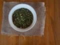
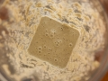

**Description**

Yogurt without the dairy, yes it’s possible! This recipe captures the creaminess of the yogurt we all grew up on, without the post-snack slump or belly pain. And the best part: It’s ready within minutes. Nutrient-enriched, protein-heavy, probiotic-dosed, digestive-friendly – all in one easy recipe. Well, what are you waiting for?  #tryit!

**Ingredients**

1 cup water 2 cups pumpkin seeds or almonds, pre-soaked 1 tbsp lemon juice ½ tsp probiotic powder

**Instructions**

**Step 1**

To a high-speed blender, add water, followed by nuts/seeds and lemon juice. Blend on low, adding more water as needed, until a creamy yogurt consistency is reached.

**Step 2**

Place raw yogurt into glass container, and add probiotic powder. Stir well.

**Step 3**

Loosely cover container with lid, leaving breathing room, and store in warm space for up to 1 day. Both microwave and ovens are good options, being mindful not to turn them on! If you’re in a hurry here, simply cover container and place immediately in fridge, or consume right away.

Eat with mixture of fresh and dried berries, chia or hemp seeds, shredded coconut, cacao nibs, or sprouted gluten-free grains.

**Tips and Techniques**

- Pre-soak nuts and seeds for 12-24 hours in a bowl of water, with one wash in between, to activate (germinate, sprout) the nuts or seeds and gain access to their nutrients.
- If you’re pressed for time, add ½ tsp probiotic powder (you can break open capsule) to your blended product, stir and refrigerate immediately.

**Why I Love My Recipe**

I gave up dairy long ago, but missed yogurt thoroughly. This recipe brings me back to the days of yogurt, except I end my snack feeling charged and light. I’m fully in control of the supplemental ingredients – be it savory or sweet, and that is a big deal, given the unhealthy, refined-sugar enriched nature of our store bought varieties. I also love the ease of making this. Soaking requires a day’s worth of planning, but post-soaking, the process can be completed in under 5 minutes. Ease and autonomy make this recipe a winner in my books.

**Benefits**

- Pumpkin seeds are loaded with minerals magnesium, zinc and tryptophan
- Almonds are rich in magnesium, potassium and the powerful antioxidant, vitamin E
- Nuts and seeds are high in health-promoting fat
- Lemons are alkalizing and cleansing
- Probiotics support the balance of good gut bacteria
