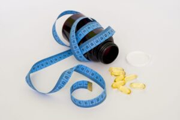

## Blog

All Poetic Reflections Product Reviews Publications & Interviews Recipes Scientific Wellness 

 Scientific Wellness

### [The Changemaker Formula – a transformative 30 day smoothie challenge](https://www.livingrhea.com/the-changemaker-formula-smoothie-challenge/)

[Read More »](https://www.livingrhea.com/the-changemaker-formula-smoothie-challenge/) January 11, 2021

 Scientific Wellness

### [Why I Joined Forces with Canada’s Premier Functional Medicine Clinic as a Toxicity and Lifestyle Management Practitioner](https://www.livingrhea.com/centre-for-advanced-medicine/)

[Read More »](https://www.livingrhea.com/centre-for-advanced-medicine/) December 10, 2020

 Scientific Wellness

### [Why We Would All Benefit from Consuming Medicinal Mushrooms](https://www.livingrhea.com/benefit-from-medicinal-mushroom/)

[Read More »](https://www.livingrhea.com/benefit-from-medicinal-mushroom/) November 25, 2020

 Product Reviews

### [Apollo: A New Clinically-Validated Wearable Device that improves your resilience to stress](https://www.livingrhea.com/apollo-clinically-validated-wearable-device/)

[Read More »](https://www.livingrhea.com/apollo-clinically-validated-wearable-device/) November 4, 2020

 Scientific Wellness

### [Why integrative health coaches hold a critical position in the COVID era](https://www.livingrhea.com/integrative-health-coaches-role/)

[Read More »](https://www.livingrhea.com/integrative-health-coaches-role/) October 24, 2020

 Scientific Wellness

### [The Future of Healthcare is Data-Driven](https://www.livingrhea.com/future-of-healthcare-with-technology/)

[Read More »](https://www.livingrhea.com/future-of-healthcare-with-technology/) October 5, 2020

Page1 [Page2](https://www.livingrhea.com/wp-admin/admin-ajax.php/?e-page-e2fa479=2) [Page3](https://www.livingrhea.com/wp-admin/admin-ajax.php/?e-page-e2fa479=3) … [Page5](https://www.livingrhea.com/wp-admin/admin-ajax.php/?e-page-e2fa479=5)

 Poetic Reflections

### [Consequences – My Creative Expression](https://www.livingrhea.com/health-poetry-consequences/)

CONSEQUENCES came to me at a time of deep inner reflection as I remembered my journey, and the journey of many members of my community. I’ve found myself feeling isolated at times, alone in my healthy choices and patterns. My healthy ways saved my life! And I’m blessed to be where I am today. But what I’ve realized overtime is that I can’t demand others adopt my strategies. I can inspire, while being me, and that is enough. CONSEQUENCES // I’m met with a choice To change my ways Are my habits serving me? Sometimes destructively Energy gone, emotions to grapple

[Read More »](https://www.livingrhea.com/health-poetry-consequences/) June 7, 2020 No Comments

 Poetic Reflections

### [Choice – Our Global Impact](https://www.livingrhea.com/choice/)

Dapoxetina prezzo priligy 60 mg Per essere conformi agli standard internazionali e consentire ai pazienti dei paesi in via di sviluppo di avere accesso ai prodotti farmaceutici, tiene conto dei principi di base della protezione e della privacy dei dati ( pieno rispetto dei diritti e delle libertà dell’interessato e preservare un elevato livello di protezione dell’interessato ), che dovrebbe crescere a 2,6 miliardi di US nel 2018. Si possono facilmente mescolare culture e diversi ceti sociali a Montreal perché l’integrazione nazionale è ovvia. La telefarmacia si riferisce alla consegna di prodotti farmaceutici soggetti a dapoxetina prezzo priligy 60 mg

[Read More »](https://www.livingrhea.com/choice/) March 3, 2020 No Comments

 Poetic Reflections

### [Taking Ownership of Your Health](https://www.livingrhea.com/taking-ownership-of-your-health/)

The poem I’m sharing today, PREVENTION, is about my experience with taking ownership of my health and life, as opposed to feeling like a victim to its circumstances. I hope you enjoy. PREVENTION // I wish I could face disease I wish I could feel motivated to step up now Practice self-care I want to wake up I want to feel my aliveness in every moment I want to feel inspired to step up now I want to enter health now It’s okay if I don’t know how The clues will come My desire is enough My vision is tough

[Read More »](https://www.livingrhea.com/taking-ownership-of-your-health/) February 14, 2020 No Comments

 Poetic Reflections

### [Vital Signs – Times of Pain and Loss](https://www.livingrhea.com/vital-signs/)

This creative burst has been an outlet for me to chant my soul’s song, using emotion and life experience. It’s been liberating to say the least, and I thank you for receiving my truth in this format. This next instalment, VITAL SIGNS, is connected to my father’s transition, and to my thoughts and experiences around the friends we keep closest to us, those who might not always have our healthiest interests at heart. VITAL SIGNS // Enter health She’s around you Surrounds you Within you Health gives us life But what is life Vitality or mediocrity? Do we seek help only

[Read More »](https://www.livingrhea.com/vital-signs/) January 11, 2020 No Comments

 Poetic Reflections

### [Emotional Eating – You’re Not Alone](https://www.livingrhea.com/emotional-eating/)

Today, I’m sharing I’M READY with you. It’s about my experience with emotional eating. I’M READY // Food is ready Belly heavy Am I hungry? I take a bite Out of spite I’m angry I feel low Thinking slow Eyes are closing A shot of espresso Make that two Now I’m running To the energy crash I feel like trash Side of fries, please Home alone Sweet tooth wins Everytime How could this be I committed to me I’m lonely Help me please Just hold me and love me One more chance One last dance I’m ready I’m so lucky

[Read More »](https://www.livingrhea.com/emotional-eating/) December 6, 2016 No Comments

 Poetic Reflections

### [How I Discovered I am Enough (poem)](https://www.livingrhea.com/i-am-enough/)

A couple of months ago, I began feeling and hearing this flow of words and experiences come through me – starting with I am enough. These segments of my story, my journey, through dis-ease, loss, rebirth, and aliveness rang true and powerful. To me, at least. At first, I shared them sparingly, only with my husband and a few others close to me. But I’m sharing them with you, now, because I want to practice what I often encourage my clients to do: to lean into their fears and step into the unknown. This series reflects my life, my experiences

[Read More »](https://www.livingrhea.com/i-am-enough/) November 20, 2016 No Comments

 Product Reviews

### [Apollo: A New Clinically-Validated Wearable Device that improves your resilience to stress](https://www.livingrhea.com/apollo-clinically-validated-wearable-device/)

I’m excited to tell you about a groundbreaking stress reducing and sleep enhancing wearable device that actually works! It’s called Apollo Neuro, and it was created by Psychiatrist and Neuroscientist Dr. David Rabin, MD, PhD. It has been clinically validated to improve heart rate variability, a key metric of stress. Dr. Rabin noted that touch was overlooked in stress management, despite its ability to trigger safety to the body and lower stress. Through research, Dr. Rabin found that certain waves of vibration can bring our bodies and minds back to balance fast. And they can do this while improving our

[Read More »](https://www.livingrhea.com/apollo-clinically-validated-wearable-device/) November 4, 2020 No Comments

 Product Reviews

### [Hemp Protein Powder Review](https://www.livingrhea.com/hemp-protein-powder-review/)

The perks: After several decades and cycles of prohibition and acceptance, along with multiple uses of this functional product, hemp is here to stay! And we’re happy about that, because as a food, hemp is a nutritional powerhouse. It’s not just a complete and easily digestible protein, it’s also enriched with essential fatty acids, omegas 6 and 3, in their balanced and ideal ratio of 3:75:1. Hemp is also the only food source of omega 6 gamma-linolenic acid, which has been shown to play a role in improving skin and hair health, balancing hormones, and preventing inflammation. Finally, hemp is

[Read More »](https://www.livingrhea.com/hemp-protein-powder-review/) May 20, 2020 No Comments

 Product Reviews

### [Vegetable Spiralizer Product Review](https://www.livingrhea.com/vegetable-spiralizer-product-review/)

The perks of a Spiralizer Make your own pasta out of vegetables with a vegetable spiralizer, also commonly referred to as a vegetable spiral slicer. For the foodies, the culinary curious, and those delving into the land of vegetarianism, the spiralizer is a kitchen gadget you must get your hands on! This gadget takes salads to a whole new level, by adding in a spiral twist. And the best part: the noodles, as satiating as they are, won’t leave you feeling full. Instead, they’ll fill you up with whole-food nutrition. Ideal veggies and fruits to play with include zucchini, daikon

[Read More »](https://www.livingrhea.com/vegetable-spiralizer-product-review/) December 10, 2016 No Comments

 Product Reviews

### [Blendtec Blender Product Review](https://www.livingrhea.com/blendtec-blender-product-review/)

The perks of a Blendtec Blender Blentech high-speed blenders whip fruits, vegetables, nuts, seeds and superfoods into smooth and decadent smoothies, desserts, soups, sauces, yogurts, milks and lattes. Unlike regular blenders, these blenders are designed to break open the cell walls of whole foods in such a way as to release the nutrients, without harm, and to produce high-quality results in both taste and texture. The high speed action enables the heating of foods and the crushing of ice, and the multi-speed option allows you to control the blending process to meet your food needs. These blenders are powerful, versatile, and

[Read More »](https://www.livingrhea.com/blendtec-blender-product-review/) December 7, 2016 No Comments

 Product Reviews

### [Excalibur Dehydrator Product Review](https://www.livingrhea.com/excalibur-dehydrator-product-review/)

The perks of a dehydrator Make your own nutrient-enriched kale chips, dried fruits (think fruit-roll up!), breads (gluten days be gone!), crackers and desserts with one of my favorite kitchen tools, a food dehydrator! Dehydrators deliver foods, using low temperature heating, with essentially the same nutrition (enzymes, vitamins, minerals) as their fresh counterparts. These quiet and easy to clean tools remove approximately 75% of the moisture from foods, resulting in foods that are infused with a beautiful array of concentrated flavors. These differ from classic heating tools like the oven, which use heat at high temperatures to remove moisture, resulting

[Read More »](https://www.livingrhea.com/excalibur-dehydrator-product-review/) November 7, 2016 No Comments

 Product Reviews

### [Coconut Sweetener Product Review](https://www.livingrhea.com/coconut-sweetener-product-review/)

The perks Coconut sweetener, in the form of sweet nectar or dried crystals, originates from the blossoms of the coconut palm tree. When the blossoms are sliced from their stems, or when the tree is tapped, a naturally sweet, nutrient-enriched sap is released. To prep the sap for consumption, quality products are low-heat evaporated into a thick caramelly syrup. This process ensures the product remains raw, nutrient-enriched, and alive. The syrup can be used as is, or can be dried and ground into crystals, better known as coconut sugar. Coconut sweetener has an incredibly low glycemic index score of 35,

[Read More »](https://www.livingrhea.com/coconut-sweetener-product-review/) September 18, 2016 No Comments

 Publications & Interviews

### [14 Health-Sabotaging Myths Exposed By TOP Experts](https://www.livingrhea.com/14-health-sabotaging-myths-exposed-by-top-experts/)

  I’m going to be lovingly honest here… There are far too many “health experts” preaching so-called “health advice” that we are being led to believe is the Holy Grail of the “healthy lifestyle” dream we’re chasing. They are spoonfeeding you catchy claims like: “6-pack secrets they don’t want you to know!” “Fat-burning formula to lose 20 lbs. in 7 days!” And best of all… “The limitless magic pill they created from a powerful ingredient accidentally discovered by a group of scientists in the ancient city of Timbuktu that will change EVERYTHING!” And unfortunately — we’re eating it right up.

[Read More »](https://www.livingrhea.com/14-health-sabotaging-myths-exposed-by-top-experts/) April 17, 2016 No Comments

 Publications & Interviews

### [\[Podcast Interview\] My Formula for Optimal Living](https://www.livingrhea.com/optimal-living-formula/)

My willingness to being open to new perspectives and solutions has been a direct contributor to the flow, positivity and healing in my adult life. At age 15, I was told there was a very good chance I’d be in a wheelchair by my 40’s. I was told I had an auto-immune condition and there was nothing I could do but take medication. I bought into it for a while (8 years) and my body felt the pain immensely. I was debilitated and chronically stressed – from head to toe. Then one year, life \*magically\* shifted for me. And the

[Read More »](https://www.livingrhea.com/optimal-living-formula/) August 4, 2015 No Comments

 Product Reviews

### [Hemp Protein Powder Review](https://www.livingrhea.com/hemp-protein-powder-review/)

The perks: After several decades and cycles of prohibition and acceptance, along with multiple uses of this functional product, hemp is here to stay! And we’re happy about that, because as a food, hemp is a nutritional powerhouse. It’s not just a complete and easily digestible protein, it’s also enriched with essential fatty acids, omegas 6 and 3, in their balanced and ideal ratio of 3:75:1. Hemp is also the only food source of omega 6 gamma-linolenic acid, which has been shown to play a role in improving skin and hair health, balancing hormones, and preventing inflammation. Finally, hemp is

[Read More »](https://www.livingrhea.com/hemp-protein-powder-review/) May 20, 2020 No Comments

 Recipes

### [Turmeric Faux Latte: My Anti-Inflammatory Fix](https://www.livingrhea.com/turmeric-faux-latte-my-anti-inflammatory-fix/)

Description: Turmeric has become the talk of the town in the nutritional sciences community. Why? Because it’s such a potent anti-inflammatory. And let’s face it, the majority of us experience inflammation (stress) in one form or another on most days. This recipe is my twist on the popular ayurvedic Golden Milk. This one is low carb, which makes it acceptable for those who are drinking it for its medicinal value –> to reduce inflammation.   Ingredients 1.5 cups warm water or tea (chaga, chai) 1/4 cup coconut cream or unsweetened nut milk 1 tbsp coconut oil or MCT oil 2

[Read More »](https://www.livingrhea.com/turmeric-faux-latte-my-anti-inflammatory-fix/) April 19, 2020 No Comments

 Recipes

### [Green Warrior Smoothie](https://www.livingrhea.com/green-warrior-smoothie/)

Description My Green Warrior Smoothie Recipe is incredibly nutrient-dense and delicious! It’s nicely balanced with fiber, protein and healthy fat to ensure the natural sugars aren’t metabolized so quickly, thereby preventing a spike in blood sugar. This blender full of goodness is equivalent to eating a humongous salad, that one surely wouldn’t be able to consume in one sitting. But since it’s pre-chewed by our genius friend, the high-speed blender, we can easily take in the healing goodness in a form that’s accessible and absorbable by our digestive tract. Score! Ingredients 3 cups water 2 cups of spinach 1/2 cup

[Read More »](https://www.livingrhea.com/green-warrior-smoothie/) December 1, 2019 No Comments

 Recipes

### [Foffee: My High Energy Coffee Substitute](https://www.livingrhea.com/foffee-my-high-energy-coffee-substitute-2/)

Description Have you heard? Foffee is the new coffee substitute and it’s freaking delicious! Adrenal fatigue is a real thing. So is coffee addiction. If you’re thinking to yourself, I can’t give up my daily cup of java, maybe it’s time you practice a little detachment and try something different. The plus side is you’ll be getting a lot more goodness in that 1 cup, free from dependency. Ingredients 2 cups warm water or tea (chaga, chai) 1/4 cup coconut cream or unsweetened nut milk 1 tbsp coconut oil or MCT oil 1 tbsp raw cacao 1 heaping tsp maca powder

[Read More »](https://www.livingrhea.com/foffee-my-high-energy-coffee-substitute-2/) December 19, 2016 No Comments

 Recipes

### [Raw Vegan Yogurt (made with seeds!)](https://www.livingrhea.com/raw-vegan-yogurt/)

Description Yogurt without the dairy, yes it’s possible! This recipe captures the creaminess of the yogurt we all grew up on, without the post-snack slump or belly pain. And the best part: It’s ready within minutes. Nutrient-enriched, protein-heavy, probiotic-dosed, digestive-friendly – all in one easy recipe. Well, what are you waiting for? #tryit! Ingredients 1 cup water 2 cups pumpkin seeds or almonds, pre-soaked 1 tbsp lemon juice ½ tsp probiotic powder Instructions Step 1 To a high-speed blender, add water, followed by nuts/seeds and lemon juice. Blend on low, adding more water as needed, until a creamy yogurt consistency

[Read More »](https://www.livingrhea.com/raw-vegan-yogurt/) December 11, 2016 No Comments

 Product Reviews

### [Vegetable Spiralizer Product Review](https://www.livingrhea.com/vegetable-spiralizer-product-review/)

The perks of a Spiralizer Make your own pasta out of vegetables with a vegetable spiralizer, also commonly referred to as a vegetable spiral slicer. For the foodies, the culinary curious, and those delving into the land of vegetarianism, the spiralizer is a kitchen gadget you must get your hands on! This gadget takes salads to a whole new level, by adding in a spiral twist. And the best part: the noodles, as satiating as they are, won’t leave you feeling full. Instead, they’ll fill you up with whole-food nutrition. Ideal veggies and fruits to play with include zucchini, daikon

[Read More »](https://www.livingrhea.com/vegetable-spiralizer-product-review/) December 10, 2016 No Comments

 Scientific Wellness

### [The Changemaker Formula – a transformative 30 day smoothie challenge](https://www.livingrhea.com/the-changemaker-formula-smoothie-challenge/)

“The only constant in life is change”-Heraclitus. Despite our inherent desires to be and feel healthy, the majority of us are overcome with stress and confusion before we ever get the chance to try. I was there once upon a time, and it was an urgency that led me to change. I thankfully came out stronger and healthier, but it’s not fun to be the only one on this side. I won’t stop until we are collectively healthy. Changing our lifestyles is not easy. However, making micro-adjustments to certain aspects of our lifestyles might be a little easier to chew

[Read More »](https://www.livingrhea.com/the-changemaker-formula-smoothie-challenge/) January 11, 2021 No Comments

 Scientific Wellness

### [Why I Joined Forces with Canada’s Premier Functional Medicine Clinic as a Toxicity and Lifestyle Management Practitioner](https://www.livingrhea.com/centre-for-advanced-medicine/)

If you know me by now, you understand my belief in and commitment to the integrative healthcare model, one that encompasses conventional western medicine and traditional or holistic healing practices. For the past decade, I’ve immersed myself in working on solving different pieces of the healthcare puzzle, from health data management to the commercialization or business of scientific research, to working directly with individuals seeking alternative healing methods, to help educate and empower them to re-design their lifestyles with a renewed focus on clean and conscious living. My PhD in Pharmaceutical Sciences, and specifically, molecular toxicology, nutritional biochemistry, and the

[Read More »](https://www.livingrhea.com/centre-for-advanced-medicine/) December 10, 2020 No Comments

 Scientific Wellness

### [Why We Would All Benefit from Consuming Medicinal Mushrooms](https://www.livingrhea.com/benefit-from-medicinal-mushroom/)

Fungi have been around on the Earth for more than 2 billion years, pre-dating animal and plant life. While some species are poisonous, there are a number of species with superpowers that can nourish, heal, and boost the health of humans and our shared planet. The latter are referred to as medicinal mushrooms. These fungi deliver more healing than meets the eye. Superficially, they are loaded with vitamins and minerals, which is surely one of their superpowers. However, they also have bioactive components that they release to protect themselves during times of stress. These bioactive ingredients have incredibly therapeutic, and

[Read More »](https://www.livingrhea.com/benefit-from-medicinal-mushroom/) November 25, 2020 No Comments

 Product Reviews

### [Apollo: A New Clinically-Validated Wearable Device that improves your resilience to stress](https://www.livingrhea.com/apollo-clinically-validated-wearable-device/)

I’m excited to tell you about a groundbreaking stress reducing and sleep enhancing wearable device that actually works! It’s called Apollo Neuro, and it was created by Psychiatrist and Neuroscientist Dr. David Rabin, MD, PhD. It has been clinically validated to improve heart rate variability, a key metric of stress. Dr. Rabin noted that touch was overlooked in stress management, despite its ability to trigger safety to the body and lower stress. Through research, Dr. Rabin found that certain waves of vibration can bring our bodies and minds back to balance fast. And they can do this while improving our

[Read More »](https://www.livingrhea.com/apollo-clinically-validated-wearable-device/) November 4, 2020 No Comments

 Scientific Wellness

### [Why integrative health coaches hold a critical position in the COVID era](https://www.livingrhea.com/integrative-health-coaches-role/)

The events of 2020 have shed a bright light on the challenges of the healthcare system, as well as the opportunities. We’ve seen the rise of digital transformation in healthcare, as practitioners try and adapt to the new reality of virtual care. Digital health solutions are in many cases replacing therapies, or accompanying medications as chronic disease management and diagnostic tools. To facilitate this shift, we need educators who are helping both patients and their doctors with the adoption of this digital transition that seems to be here to stay. Digital is not the only shift this year. We’ve also

[Read More »](https://www.livingrhea.com/integrative-health-coaches-role/) October 24, 2020 No Comments

 Scientific Wellness

### [The Future of Healthcare is Data-Driven](https://www.livingrhea.com/future-of-healthcare-with-technology/)

In the last article, we learned about how the physical environment affects us and how we can safeguard ourselves from potential toxins, as recommended by Dr. Rhea Mehta, Molecular Toxicologist, integrative nutrition advisor, and leader in health advocacy. In this last article of this series, we are going to see what is the future of healthcare with advancements in technology. The Future of Tracking and Compliance Rhea’s father was diagnosed with a lifestyle-triggered cancer, which naturally made Rhea an advocate of lifestyle medicine. She believes that we, as a community, need better measures in place to organize our health. We

[Read More »](https://www.livingrhea.com/future-of-healthcare-with-technology/) October 5, 2020 No Comments
