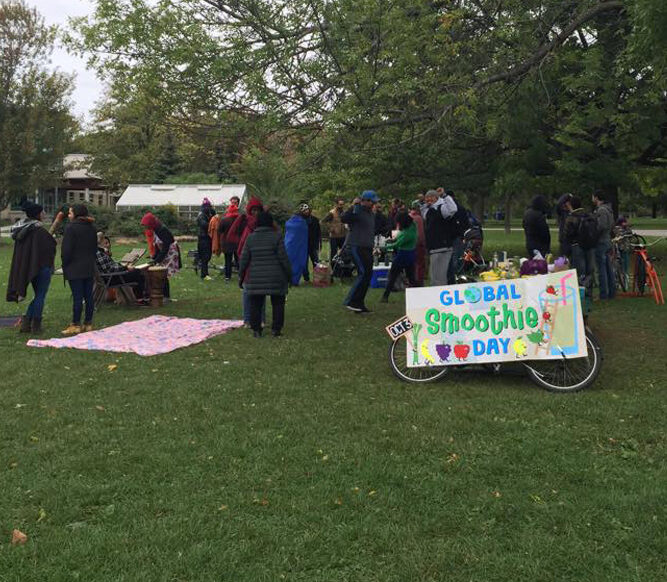
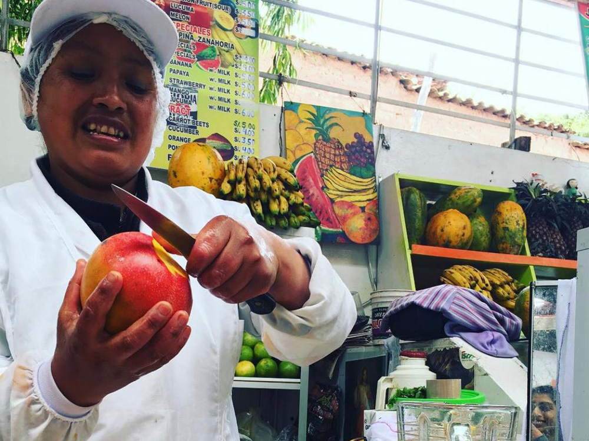

\[rev\_slider alias="main-home-1" slidertitle="GSD"\]\[/rev\_slider\]

The GSD mission is to inspire as many people around the world to view the adoption of a nutritious, plant-based smoothie lifestyle as achievable and exciting.

Why we care: We are entering a globally turbulent time. To survive as a collective, we must help each other reconnect to our bodies so we can better hear our inner truths. That starts with what we put inside!

CALL TO ACTIONInspire your online community by sharing a smoothie selfie, a recipe, or re-sharing one of our photos below using the hashtag #globalsmoothieday 

<figure>

<figcaption>

Global Smoothie Day Community Event

</figcaption>

</figure>

<figure>

<figcaption>

Global Smoothie Day Community Event

</figcaption>

</figure>

<figure>

<figcaption>

Global Smoothie Day Community Event

</figcaption>

</figure>

<figure>

<figcaption>

Global Smoothie Day Community Event

</figcaption>

</figure>

<figure>

<figcaption>

Global Smoothie Day Community Event

</figcaption>

</figure>

### CLIMATE-FOCUSSED INTERVIEW WITH [MINDBODYGREEN](https://www.mindbodygreen.com/articles/green-smoothie-recipe-that-incorporates-leftovers) ON [GLOBAL SMOOTHIE DAY](https://www.livingrhea.com/dr-rheas-research/healthy-green-smoothies/) FEATURING “LEFTOVERS SMOOTHIE”

# 6 Years of Global Smoothie Day Highlights

<iframe src="https://www.youtube.com/embed/unWa3A6urZc" style="position: absolute; top: 0; left: 0; width: 100%; height: 100%;" frameborder="0" allowfullscreen></iframe>

Vegetarian Food Festival Q&A with Plant Based Policy Expert Nital Jethalal

 

Instagram Live Interview with Chef Charles Michel, Finalist on Netflix’s The Final Table

MindBodyGreen interview with Global Smoothie Day featuring the 2020 “Leftovers Smoothie”

GSD COMMUNITY PARTIES

<figure>

<figcaption>

Global Smoothie Day Community Event

</figcaption>

</figure>

<figure>

<figcaption>

Global Smoothie Day Community Event

</figcaption>

</figure>

<figure>

<figcaption>

Global Smoothie Day Community Event

</figcaption>

</figure>

<figure>

<figcaption>

Global Smoothie Day Community Event

</figcaption>

</figure>

<figure>

<figcaption>

Global Smoothie Day Community Event

</figcaption>

</figure>

<figure>

<figcaption>

Global Smoothie Day Community Event

</figcaption>

</figure>

<figure>

<figcaption>

Global Smoothie Day Community Event

</figcaption>

</figure>

<figure>

<figcaption>

Global Smoothie Day Community Event

</figcaption>

</figure>

<figure>

<figcaption>

Global Smoothie Day Community Event

</figcaption>

</figure>

GSD COMMUNITY PARTY CROATIA! 

### GSD COMMUNITY PARTY INDIA!

### GSD COMMUNITY PARTY KENYA!

### GSD COMMUNITY PARTY UGANDA!

 BESIDES CELEBRATING WITH US ON OCTOBER 3RD EVERY YEAR (MARK YOUR CALENDARS!), YOU CAN SUPPORT OUR MISSION BY:

- Making smoothies with and for your family and friends
- Visiting the [smoothie](https://www.livingrhea.com/tag/green-smoothies/) bars who are making high quality (nutrient-dense, local, organic) drinks in your area
- Sharing our amazing starter kit and e-book with those you love

  [DOWNLOAD OUR FREE GSD ON-BOARDING GUIDE & RECIPE BOOK](https://www.dropbox.com/s/btdvkhr22sg1otp/Global%20Smoothie%20Day%20E-Book_2020.pdf?dl=0)

### JOIN OUR MOVEMENT AND TOGETHER LET’S PROMOTE INCLUSIVE WELLBEING THROUGH SMOOTHIE SOLIDARITY

As featured in

 

> “THE #GLOBALSMOOTHIEDAY MISSION IS TO RAISE AWARENESS OF WHOLE FOOD BLENDED NUTRITION IN A WAY THAT’S EASY AND FUN.”
> 
> DR. MARK HYMAN, 10X NEW YORK TIMES BEST SELLING AUTHOR
